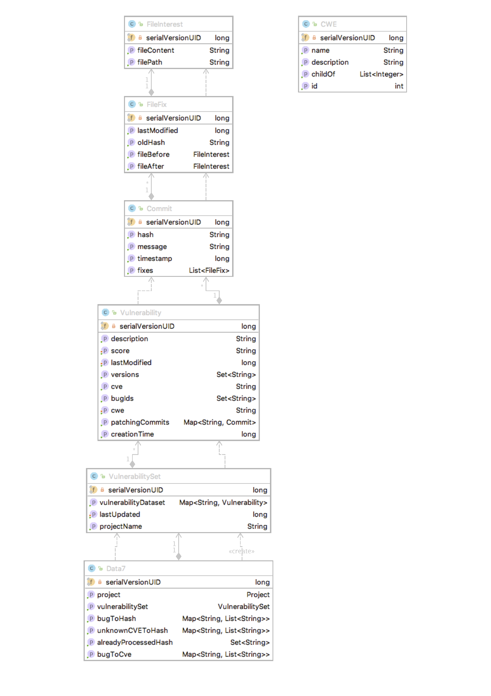

# Data7 Project: An automatically generated Vulnerability dataset

[](https://opensource.org/licenses/Apache-2.0)


## Citing Data7

The Data7 was published as an engineering paper in SCAM'18. You can find it here:
[](http://hdl.handle.net/10993/36157)

To cite Data7, pleae use the following bib entry:
[](data7.bib)

## What is it?

Data7 is a tool that put together vulnerability report and vulnerability patches  of a given software project in an automated way under the form of a dataset. Once created the dataset can then easily be updated with the latest information available. The information that can be found in the dataset is the following:
    
* CVE number
* description
* CWE number (if applicable)
* time of creation 
* time of last modification
* CVSS severity score
* bug ids (if existing)   
* list of impacted versions
* list of commits that fixed the vulnerability which contains:
	- hash
	- timestamp
	- message
	- fixes (files in their states before and after fix)
    
## Why? 

When investigating a vulnerability, a security analyst need as much information as possible on it and usually reports are a good starting point. However, the most insightful piece of information on the vulnerability is usually the fix that was created to solve it. From the fix, the origin of the vulnerability and its type can be determined. Fixes when available can be found as separated links in the reports but it is far from being always the case. 
If linking fixes and reports by hand is possible, it is time consuming. So when the analysis of not one but many vulnerabilities is considered then it is not possible to do it by hand anymore. A good example of a case where the analysis of a large number of vulnerabilities is required is the creation of a Vulnerability Prediction Model. 

Thus, the link should be made automatically and not manually which is possible by cross-checking information from vulnerability report, bug trackers and versioning history and that's precisely what data7 is doing.

## Requirements

To create and update a dataset an internet connection is required. However nothing is required to read an existing data7.
Other dependencies are handled through maven.

## How does it work ?

For a given project P

* Creating a dataset
    1. Data7 will first connect to the NVD database and download all the XML feeds for vulnerabilities (2002-Current Year)
    2. Data7 will then parse all the XML and retrieve all vulnerabilities reported for P over the history
    3. For each vulnerability, all declared links are analysed and if a mention to a bug report is made or a link to a fix commit is present, they are saved
    4. The git repository of P is cloned in a local folder
    5. For each vulnerability that had a link to a fixing commit, all information on the commit are retrieved from the git repository and added to the one of the vulnerability
    6. For each commit in the versioning history that was not yet analysed in (v.), analyse the message and look for a bug id that was present in the report or for a CVE Identifier and if a match is made then commit information is added to the vulnerability information.


* Updating a dataset
    1. Data7 first check when the latest update occurred, if less than 7 days passed since the last update, only the modified and recent xml feed are downloaded, otherwise all xml feeds from years that have been modified since the last update are downloaded
    2. Data7 will then parse the XML and retrieve all vulnerabilities reported for P and create a new entry if there is a new vulnerability or update it if necessary
    3. For each updated or created vulnerability entry, look for a new link of commit fix and/or bug id.
    4. The git repository is pulled
    5. For all new/updated entry  that has a new link, retrieve the commit information
    6. For all entry that has a new bug id, check whether this bug id was already found in the commit history (from a previous crawl)
    7. For all latest commit (since latest update), analyse the message and look for a bug id that was present in the report or for a CVE Identifier and if a match is made then the commit information is added to the vulnerability information. 


## Dataset Structure

The dataset generated by data7 can be accessed in two ways (a third one is planned in the future) either through an API relying on a data7 Object that can be serialized or through an XML file.

### API (binary form)



When calling upon the creation or the update of a dataset, the user will receive a Data7 object. This object contains information on the project the dataset is based on (see next section), and the vulnerability dataset (VulnerabilitySet Object), other fields are present but only contain additive information required by the tool for update such as a list of bug id and their corresponding hash commit, a list of bug id to CVE identifiers, a list of all hash already processed and a list of found cve identifiers in commit for whose report is not yet available which can be interesting to investigate not yet disclosed vulnerabilities.

The vulnerabilitySet object is composed of the following information, a list of every vulnerability ever reported for the chosen project (list of Vulnerability Object) and the last time the dataset was updated last.

A Vulnerability Object entry has the following information integrated:

* CVE number
* description of the vulnerability in the report
* CWE number (if applicable)
* time of creation 
* time of last modification
* CVSS severity score
* bug ids (if existing, can be more than one)   
* list of impacted versions
* list of fixing commit (Commit object)

A Commit Object contains the hash, the message and the timestamp of the commit as well as the list of files that were modifier (FileFix Object).

A FileFix Object contains information on time the file was last modified before the given commit and its corresponding previous hash as well as the file in its state before and after commit (FileInterest Object).

A FileInterest Object contains the text of the file and its fullPath in the project.


### XML exporter

The dataset can as well be exported as an XML file that will only contain vulnerability with reported fixes.
The schema of the xml is the following:

```xml
<?xml version="1.0" encoding="UTF-8" standalone="no"?>
    <data7 last_updated="YYYY-MM-DD HH:mm:ss CEST" project="project name">
      <cve id="CVE-YYYY-XXXXXX" last_modified="timestamp">
        <cwe></cwe>
        <score></score>
        <description></description>
        <affectedVersions>
          <version></version>
        </affectedVersions>
        <bugs/>
        <patches>
          <commit hash="aaaaaaa" timestamp="xxxxxxx">
            <message></message>
            <files>
              <file>
                <before hash="aaaaaaaa" path="src/file.c">
                Content of the file
                </before>
                <after path="src/file.c">
                Content of the file
                </after>
              </file>
            </files>
          </commit>
        </patches>
      </cve>
    </data7>
```                

### Extending to other tools/database

As analysts might want to import the dataset to their own tool or favourite database, a last option is possible that allow the user to import the data at the same time the dataset is being built/update through an Observer. Indeed, when asking to update/create a dataset the user can pass as an argument a listener that implements the DatasetUpdateListener interface that will notify of the latest update in live.

The interface offer 6 notifications:

* when a bug is added to a vulnerability
* when a commit is added to a vulnerability
* when a score is updated (CVSS)
* when a cwe is updated
* when a new vulnerability is added
* when the update is finished

and is presented as follows:

```java
package data7.importer.cve;

import data7.model.vulnerability.Vulnerability;

import java.util.EventListener;

public interface DatasetUpdateListener extends EventListener {

    void bugAddedTo(Vulnerability vulnerability, String bugId);

    void commitAddedTo(Vulnerability vulnerability, String hash);

    void scoreUpdatedFor(Vulnerability vulnerability);

    void cweUpdatedFor(Vulnerability vulnerability);

    void addVulnerability(Vulnerability vulnerability);

    void updatefinished();
}
``` 

This interface allows to develop more functionality for the dataset such as the one currently in development in the graph section, which uses a temporal graph database to store the dataset. Note that it might be better to first do a batch import and then use the interface when update is being done.

## Supported projects

Currently five open source projects are supported :

* Linux Kernel
* Wireshark
* OpenSSL
* SystemD
* **Android (new)**

but it can easily be extended to any other project where it is possible to find the following information:

*  name of the project as it appears in NVD database, e.g, linux_kernel
*  url of a git remote repository, e.g, https://github.com/torvalds/linux
*  regular expression catching link to remote repository and hashes in it, e.g, 
```
.*?(github\\.com|git\\.kernel\\.org).*?(commit)+.*?(h\\=|/)+([a-f0-9]+)
```
*  url of a bug tracker, e.g, https://bugzilla.kernel.org/
*  regular expression catching link to bug tracker and bug id in it, e.g,
```
.*(bugzilla\\.kernel\\.org).*?(id\\=)([0-9]+)
```
*  regular expression catching bug id in git commit message, e.g, 
```
.*(bugzilla\\.kernel\\.org).*?(id\\=)([0-9]+)
```

## How to use the tools

1. you can run mvn install and the tool is installed
2. To use the tool, the first step is to create a folder in your local storage that will gather all data.
    The structure once run the tool should look like this
    - myfolder
        - git
        - cve
        - xml
        - binary
    
3. Once done, just call it as follow:

```java
 import data7.project.CProjects;
 import data7.project.Project;   
 import data7.Importer;
 import data7.Exporter;
 import data7.ResourcesPath;
 
 //Indicate your path
 ResourcesPath path = new ResourcesPath("path to your folder");

 //To create or update a project
Importer importer = new Importer(path);
importer.updateOrCreateDatasetFor(aProject);
// Projects are available in projects module
//like CProjects.LINUX_KERNEL

//To simply load a dataset without any update
Exporter exporter = new Exporter(path);
exporter.loadDataset(project);
// here just the name (String) is enough

// To export to xml
exporter.exportDatasetToXML(data7);

``` 
    
Note that on creation of the dataset it might be better for the largest project (Linux, Wireshark)to first clone the git repository using command line in your folder under the subfolder git (in the case of Linux, don't forget to rename the created folder "linux" into "linux_kernel")

## Statistics

As of 5th June 2018

| Projects   | Time to create | Dataset size |Number of vulnerabilities | NoV with Fixes | average CVSS | avg CVSS with fixes | Number of Fix | Number of FileFix| Number of Unique Vulnerable Files |
|:----------:|:--------------:|:------------:|:------------------------:|:--------------:|:------------:|:-------------------:|:-------------:|:----------------:|:---------------------------------:|
|Linux Kernel|115 mn          |279.7 MB      |2082                      |1202            |5.41          |5.34                 |1332           | 2612             |1508                               |
|Wireshark   |129 mn          |561.9 MB      | 531                      | 265            |4.99          |5.01                 | 850           |  987             | 221                               |
|OpenSSL     |  8 mn          |173.3 MB      | 187                      | 126            |5.34          |5.42                 | 493           | 1018             | 164                               |
|SystemD     |  2 mn          |  2.4 MB      |   9                      |   5            |5.76          |5.60                 |   5           |    6             |   5                               |
|Total       |254 mn          |  1.0 GB      |2809                      |1598            |5.375         |5.34                 |2680           | 4623             |1898                               |

### Top 10 CWE

| Rank | Linux    | Wireshark | OpenSSL | SystemD |
|:----:|:--------:|:---------:|:-------:|:-------:|
| 1    | 264 (318)|  20 (136) | 310 (32)| 20 (3)  |
| 2    | 200 (219)| 399 (108) | 399 (28)| 264 (2) |
| 3    | 399 (212)| 119  (98) | 116 (17)| 362 (2) |
| 4    | 119 (204)| 189  (51) | 200 (15)| 787 (1) |
| 5    |  20 (161)| 400  (14) |  20 (12)| 119 (1) |
| 6    | 189 (106)|  74   (9) | 189 (11)| -       |
| 7    | 362  (89)| 476   (8) | 362  (5)| -       |
| 8    | 476  (45)| 134   (5) |   -     | -       |
| 9    | 284  (45)| 200   (4) |   -     | -       |
| 10   | 416  (28)| -         |   -     | -       |


### Top 10 CWE with Fixes

| Rank | Linux    | Wireshark | OpenSSL | SystemD |
|:----:|:--------:|:---------:|:-------:|:-------:|
| 1    | 119 (163)|  20 (81)  | 310 (20)| 264 (1)|
| 2    | 399 (146)| 399 (62)  | 399 (20)| 787 (1)|
| 3    | 200 (137)| 119 (52)  | 200 (15)| 119 (1)|
| 4    | 264 (135)| 400 (14)  | 119 (12)| 20 (1) |
| 5    |  20 (134)| 189 (10)  |  20 (12)| 362 (1)|
| 6    | 189  (88)|  74  (9)  | 189  (6)|        |
| 7    | 362  (72)| 476  (8)  | 362  (4)|        |
| 8    | 476  (35)| 19   (3)  | -       |        |
| 9    | 416  (25)| 754  (3)  | -       |        |
| 10   | 125  (20)| -         | -       |        |

### Top 10 CWE ratio 

| Rank | Linux    | Wireshark | OpenSSL  | SystemD  |
|:----:|:--------:|:---------:|:--------:|:--------:|
| 1    |  17 (100)| 400 (100) | 200 (100)| 787 (100)|
| 2    | 415 (100)|  74 (100) |  20 (100)| 119 (100)|
| 3    | 310  (92)| 476 (100) | 362 (80) | 264  (50)|
| 4    |  19  (91)|  19 (100) | 399 (71) | 362  (50)|
| 5    | 416  (89)| 754 (100) | 119 (70) |  20  (33)|
| 6    | 125  (86)|  20  (60) | 310 (62) | -        |
| 7    |  20  (83)| 399  (57) | 189 (54) | -        |
| 8    | 189  (83)| 119  (53) | -        | -        |
| 9    | 362  (81)| 189  (20) | -        | -        |
| 10   | 119  (80)| -         | -        | -        |


### Top 10 Vulnerable Files

| Rank | Linux                     | Wireshark                              | OpenSSL                    | SystemD                                |
|:----:|:--------------------------|:---------------------------------------|:---------------------------|:---------------------------------------|
| 1    | arch/x86/kvm/x86.c (17)   | epan/proto.c (24)                      | ssl/s3_clnt.c (53)         | src/resolve/resolved-dns-packet.c (2)  |
| 2    | fs/namei.c (14)           | epan/dissectors/packet-nbap.c (19)     | ssl/s3_srvr.c (41)         | src/resolve/resolved-dns-packet.h (1)  |
| 3    | net/socket.c (14)         | epan/dissectors/packet-ncp2222.inc (19)| ssl/d1_both.c (35)         | src/util.c (1)                         |
| 4    | kernel/signal.c (14)      | epan/dissectors/packet-wccp.c (18)     | ssl/t1_lib.c (34)          | src/nss-mymachines/nss-mymachines.c (1)|
| 5    | fs/namespace.c (14)       | epan/crypt/airpdcap.c (18)             | ssl/d1_pkt.c (22)          | src/tmpfiles/tmpfiles.c (1)            |
| 6    | kernel/bpf/verifier.c (13)| epan/dissectors/packet-ber.c (17)      | crypto/asn1/tasn_dec.c (20)| -                                      |
| 7    | net/sctp/socket.c (13)    | epan/dissectors/packet-umts_fp.c (16)  | ssl/ssl.h (20)             | -                                      |
| 8    | fs/exec.c (13)            | epan/dissectors/packet-wbxml.c (15)    | ssl/s3_pkt.c (20)          | -                                      |
| 9    | arch/x86/kvm/vmx.c (13)   | epan/dissectors/packet-wsp.c (14)      | ssl/ssl_err.c (17)         | -                                      |
| 10   | fs/open.c (12)            | epan/dissectors/packet-wcp.c (13)      | crypto/x509/x509_vfy.c (16)| -                                      |

## Additional Libraries Included

In this tool, three custom-made libraries are included:

### Git Utils

This library coded in Kotlin provide some useful function when trying to mine a git repository.
The following methods are available

* retrievingFileFromSpecificCommit
* listOfCommitImpactingAFile
* previousCommitImpactingAFile
* gitBlame
* gitBlameNbDev
* getDevHistoryOfAFile (use Developer History class)
* getDeltaFile (Delta History)
* getListOfModifiedFile
* getCommitMessage
* getTimeCommit

this library work on local repository but also offer the possibility to clone a remote repository: 

```kotlin
   // for already existing git repo  
     val git = GitUtilitary("pathto .git folder")
   // to clone the repo
     val git = GitUtilitary("remote repo adress","path to folder")
```

### Misc

This library coded as well in Kotlin contains additional useful function such as downloading a file, unzipping a file, normalizing a path and getting the recursive list of directories.

### CWE Importer

For those wishing to analyse cwe as well a last library is made available. The library can simply be called using:
```java
Importer.getListOfCWE();
```
This call will download on the nvd website the xml with all the description of CWE and parse it before serializing for good. This is especially useful for studies that focus on CWE when using the data7. In addition a field childOf is present for each CWE which allows to rebuild the hierarchy of CWE type.

## About Me

This tool was developed during my thesis and is made available to everyone. :)


